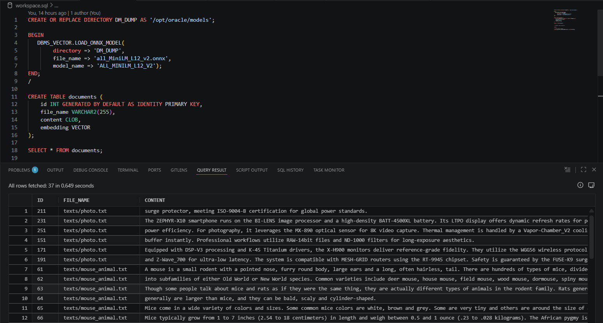
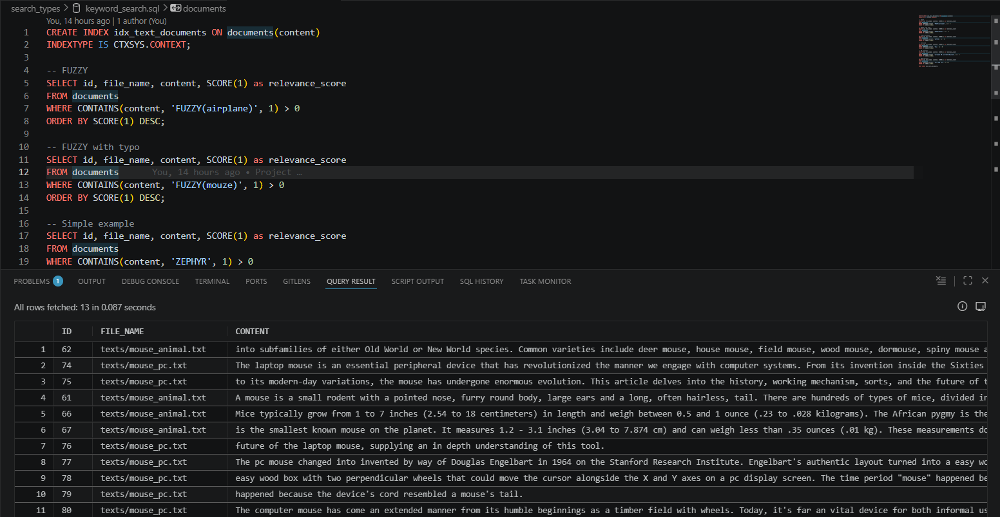
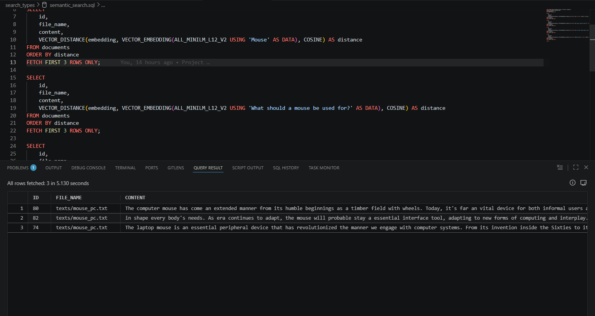
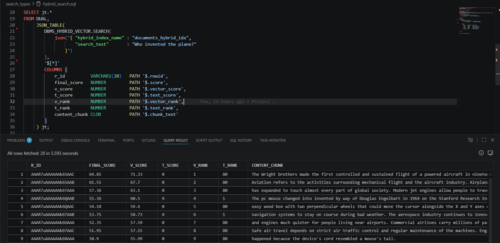

# Oracle AI Vector Search

## Structură proiect

- `docker-compose.yml`: Fișierul de configurare pentru pornirea bazei de date Oracle folosind Docker.
- `texts/`: Folder cu fișierele text ce vor fi folosite pentru exemplificarea căutărilor.
- `main.py`: Script pentru parsarea fișierelor text, generarea embedding-urilor și încărcarea acestora în baza de date.
- `workspace.sql`: Fișier SQL pentru crearea tabelei „documents” și încărcarea modelului de embedding.
- `search_types/`: Folder cu fișierele SQL pentru fiecare tip de căutare (keyword, vector și hybrid).


## Workflow

1. Pornim containerul Docker folosind
    ```bash
    docker compose up -d
    ``` 

2. Configurăm conexiunea
- Connection name: Oracle26ai
- User Info:
    - Authentication type: Default
    - Role: SYSDBA
    - Username: sys
    - Password: `<parola din docker-compose.yml>`
- Connection type: Basic
- Details:
    - Host name: localhost
    - Port: 1522
    - Type: Service Name
    - Service name: FREE

3. Descărcăm modelul de embedding de pe acest site și am urmat instrucțiunile pentru încărcarea în baza de date: https://blogs.oracle.com/machinelearning/use-our-prebuilt-onnx-model-now-available-for-embedding-generation-in-oracle-database-23ai

4. Instalăm librăriile necesare pentru scriptul `main.py` folosind `uv`.
    ```bash
    uv sync
    ```

5. Parsăm fișierele text, generăm embedding-urile și încărcăm datele în baza de date rulând scriptul `main.py`.
    ```bash
    python main.py
    ```

6. Rulăm interogările SQL din folderul `workspace.sql` pentru a crea tabela „documents” și a încărca modelul de embedding.



7. Rulăm interogările SQL din folderul `search_types/` pentru a testa fiecare tip de căutare (keyword, vector și hybrid).

- Keyword search:
    


- Semantic search:


- Hybrid search:


## Bibliografie

1. Giggs, R. (2026) Oracle AI Vector Search in oracle database 23ai, DEV Community. Available at: https://dev.to/derrickryangiggs/oracle-ai-vector-search-in-oracle-database-23ai-54m8 (Accessed: 26 April 2026).
2. Heshan, D. (2025) Keyword search vs vector search vs hybrid search: Understanding modern information retrieval | by Dilanka Heshan | Medium, Medium. Available at: https://medium.com/@bhdilanka/keyword-search-vs-vector-search-vs-hybrid-search-understanding-modern-information-retrieval-33b68425b295 (Accessed: 26 April 2026).
3. LaMonica, S. (2024) Now available! pre-built embedding generation model for Oracle Database 26ai, Oracle Machine Learning. Available at: https://blogs.oracle.com/machinelearning/use-our-prebuilt-onnx-model-now-available-for-embedding-generation-in-oracle-database-23ai (Accessed: 27 April 2026).
4. Matricardi, F. (2024) Maybe keyword search is all you need | by Fabio Matricardi | Medium, Medium. Available at: https://medium.com/@fabio.matricardi/maybe-keyword-search-is-all-you-need-4c1cdedbb3f9 (Accessed: 26 April 2026).
5. Oracle AI Vector Search User’s Guide (2026) Oracle Help Center. Available at: https://docs.oracle.com/en/database/oracle/oracle-database/26/vecse/search.html (Accessed: 29 April 2026).
6. Shin, M. (2025) Hybrid search: Definition, how it works, benefits and more, meilisearch. Available at: https://www.meilisearch.com/blog/hybrid-search (Accessed: 26 April 2026).